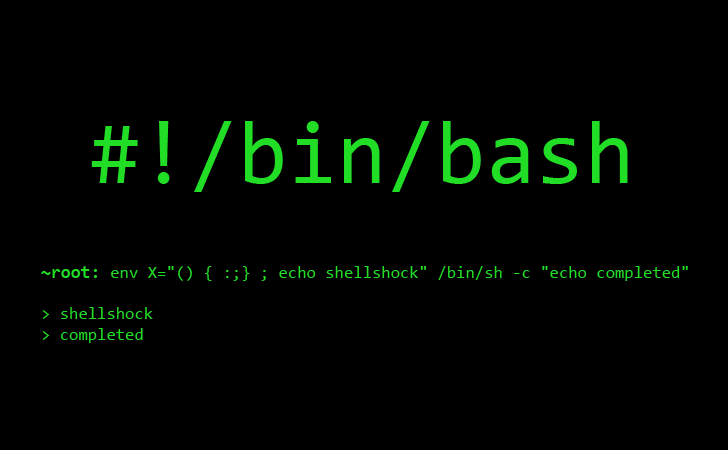

# Comandos Unix Úteis
Você também pode ler em [Inglês](../README.md).

## Sobre
> Caso você esteja iniciando com comandos bash e não é tão familiar com alguns destes comandos, este repositório tem o objetivo de lhe ajudar. Caso saiba de algum comando que não esteja aqui ou de algo que possa ser melhor explicado fique à vontade para fazer um <i>fork</i> e um <i>pull request</i>. *

## Tabela de Conteúdo
* [Atalho para o Diretório Home](#atalho-para-o-diretório-home)
* [Diretório Corrente de Trabalho](#diretório-corrente-de-trabalho)
* [Listando Arquivos](#listando-arquivos)

#### Atalho para o Diretório Home
Em sistemas Unix, você pode referenciar seu diretório a partir de qualquer pasta que esteja apenas digitando o caracter til(~). Caso você teste digitar ~ no seu terminal, você terá a seguinte mensagem:

```sh
$ ~
-bash: /Users/rafaelcfreire: is a directory
```

#### Diretório Corrente de Trabalho
Este comando imprime o local aonde você está em qualquer momento no seu sistema de arquivos. Vá para um diretório específico e digite <i>pwd</i> em seu terminal:

```sh
$ pwd
/Users/rafaelcfreire/github/unix-commands
```

#### Listando Arquivos
O comando <i>ls</i> mostra os arquivos e diretórios que estão abaixo do diretório corrente por padrão, caso queira ver de diretórios diferentes apenas especifique tal endereço como mostrado a seguir.

Lista o diretório corrente
```sh
$ ls
```

Lista o diretório <i>files</i>
```sh
$ ls /home/personal/files
```

A sintaxe do comando <i>ls</i> é:
```sh
ls [options] [names]
```

E caso queira compreender melhor os parametros para <i>options</i>, uma lista está disponível [aqui](http://www.techonthenet.com/unix/basic/ls.php)

